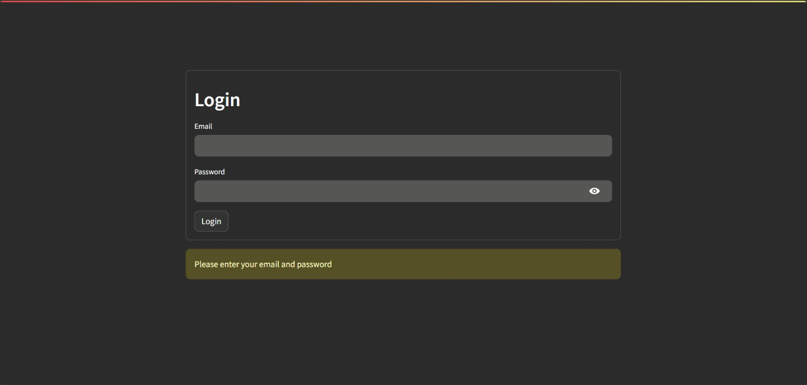
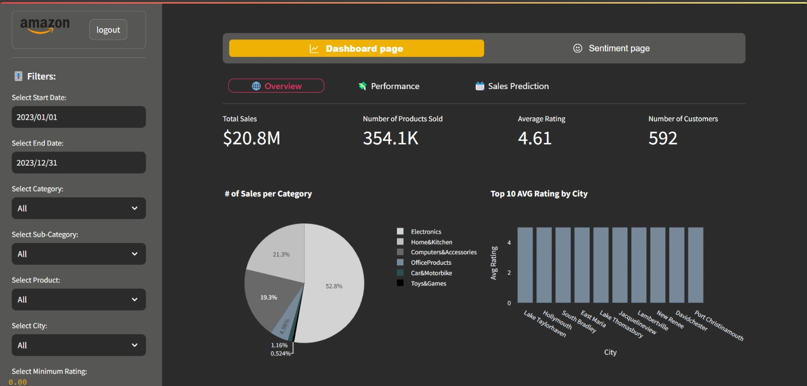
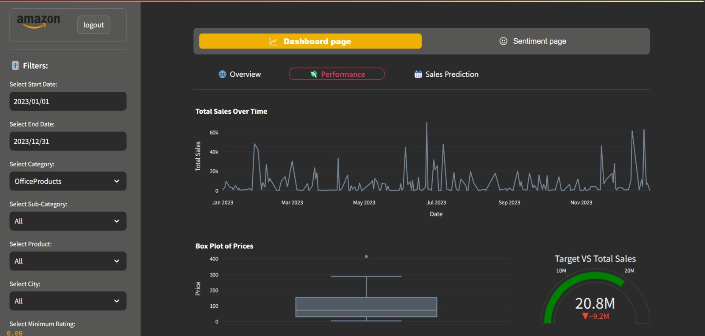
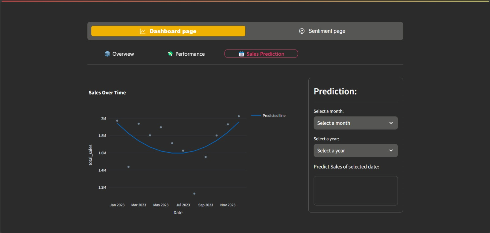
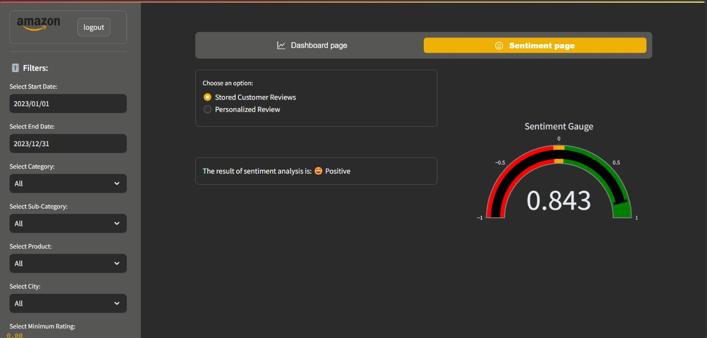
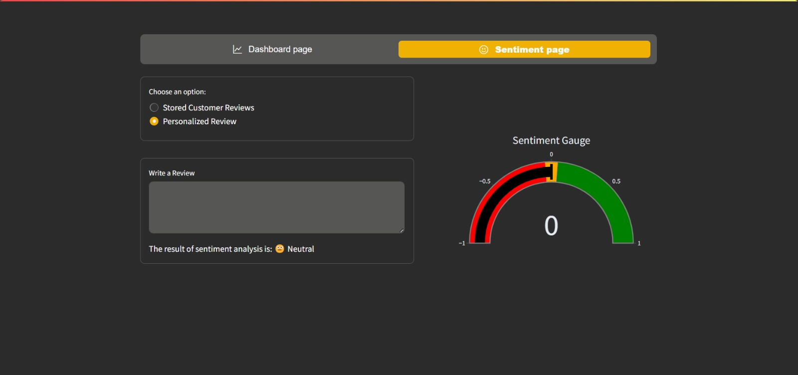
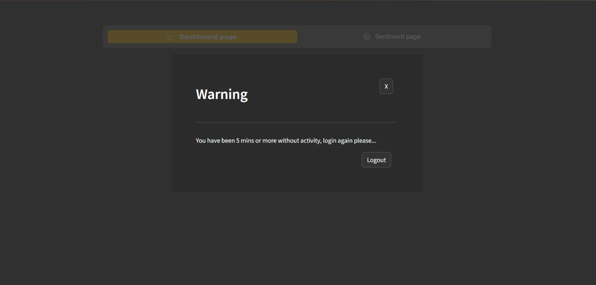

# 📊 Amazon Sales Data Analysis & Prediction System

## 📌 Project Overview

This project is a web-based **Sales Data Analysis System** developed for the Amazon Sales Department.  

The system integrates:
* Data Analysis
* Machine Learning
* Database Management
* Interactive Dashboards

It enables authorized users to:
* Monitor sales performance
* Analyze trends and categories
* Predict future sales
* Perform sentiment analysis on customer reviews
* Make data-driven decisions

---

# 🏗️ System Architecture

The system follows a **Layered Architecture Model** consisting of three layers:

```
Presentation Layer (UI)
        ↓
Business Logic Layer
        ↓
Database Layer
```

## 1️⃣ User Interface (UI) Layer
* Handles user interaction
* Displays dashboards and visualizations
* Manages login and sessions

## 2️⃣ Business Logic Layer
* Core system logic
* Data filtering and aggregation
* Machine learning processing
* Sales prediction
* Sentiment analysis

## 3️⃣ Database Layer
* Stores structured data
* Manages relationships
* Handles write operations

---

# 🗄️ Database Design

The data was migrated from Excel sheets into a relational database.

## Main Tables

### Product
* product_id (PK)
* product_name
* category
* sub_category

### Customer
* customer_id (PK)
* customer_name
* city

### User
* user_id (PK)
* user_name
* email
* password

### Sales
* sales_id (PK)
* product_id (FK)
* customer_id (FK)
* quantity
* actual_price
* discounted_price
* discounted_percentage
* date

### Reviews
* review_id (PK)
* product_id (FK)
* customer_id (FK)
* review_title
* review_content
* rating

---

# 📊 System Interfaces

---

## 🔐 Login Interface

Authorized users can log into the system securely.



---

## 📈 Dashboard – Overview Page

Contains:
* Summary statistic cards
* Pie chart (Sales per Category)
* Advanced filtering options



---

## 📉 Dashboard – Performance Page

Contains:
* Total Sales Over Time (Line Chart)
* Performance analytics
* Date-based filtering



---

## 🔮 Dashboard – Sales Prediction Page

Contains:
* Scatter plot (Actual Sales)
* Polynomial Regression prediction line
* Future month/year sales prediction



---

## 💬 Sentiment Analysis – Stored Reviews

Contains:
* Gauge chart visualization
* Classification into:
  - Positive
  - Neutral
  - Negative



---

## ✍️ Sentiment Analysis – Personalized Review

Users can input custom review text for instant sentiment analysis.



---

## ⏳ Automatic Logout

If user is inactive for 5 minutes:
* Warning message appears
* Background is blurred for privacy
* User must click logout



---

# 🧠 Machine Learning Components

* Polynomial Regression for Sales Forecasting
* Sentiment Analysis Model for Review Classification
* Data preprocessing pipeline

---

# 🧪 Testing

## System Testing
* Login validation (valid / invalid)
* Database retrieval
* Session timeout
* Dashboard filtering
* Sentiment prediction accuracy

All test cases passed successfully.

## User Interface Testing
* Date validation logic
* Rating filter validation
* Session inactivity handling
* Error message validation

---

# 🛠️ Technologies Used

* Python
* Pandas
* NumPy
* Scikit-learn
* Relational Database
* Data Visualization Libraries
* Web Framework (Layered Architecture)

---
